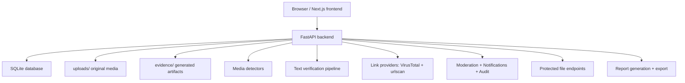

# DeepShield AI: Full Implementation Deep Dive

Generated from direct code inspection on 2026-03-19.

This document describes the application exactly as it is currently implemented in the repository. It is not a product brochure and it is not based on the PDF alone. The source of truth for this document is the running code in the backend, frontend, database initialization, detectors, services, and routes.

If a UI label and backend behavior disagree, backend behavior wins. Example: the upload UI says `50MB`, but backend validation currently allows up to `100MB`.

## 1. Executive Summary

DeepShield AI is a full-stack trust-analysis platform with three primary analysis pipelines:

1. Media analysis
   - Images
   - Videos
   - Audio
2. Text verification
   - Claim-oriented misinformation / fake-news style analysis
3. Link detection
   - URL reputation and page-risk scanning using VirusTotal and urlscan

All three pipelines converge into the same cross-cutting control plane:

- Common verdict model
- Moderation rules
- Manual admin review
- Notifications
- Audit logging
- Unified history
- Permission-aware sharing
- Protected file delivery

The app is built with:

- Backend: FastAPI + SQLite + async services
- Frontend: Next.js 16 + React 19
- File storage: local disk
- Auth: JWT bearer tokens

## 2. Repository and Runtime Layout

### 2.1 Main backend areas

- `backend/main.py`
  - FastAPI app setup, CORS, router registration, startup lifecycle
- `backend/config.py`
  - environment loading and runtime configuration
- `backend/database.py`
  - schema creation, lightweight migrations, admin seeding, default rule seeding
- `backend/auth.py`
  - password hashing, JWT creation/verification, current-user resolution, admin requirement
- `backend/routes/`
  - API endpoints
- `backend/services/`
  - moderation, reports, audit, unified content aggregation, verdict normalization
- `backend/detectors/`
  - media, text, and link analysis logic
- `backend/uploads/`
  - original uploaded media
- `backend/evidence/`
  - generated evidence files such as image heatmaps
- `backend/deepshield.db`
  - SQLite database

### 2.2 Main frontend areas

- `frontend/src/app/page.tsx`
  - login/register screen
- `frontend/src/app/dashboard/`
  - all authenticated pages
- `frontend/src/components/DashboardLayout.tsx`
  - shell, sidebar, auth bootstrap, notifications badge
- `frontend/src/lib/api.ts`
  - frontend API client, token handling, download helpers

## 3. High-Level Architecture

### 3.1 Core design pattern

Each content type has its own analysis pipeline, but the post-analysis lifecycle is shared:

1. Receive input
2. Validate input
3. Create or update a content row
4. Run analysis
5. Normalize verdict
6. Persist analysis output
7. Apply moderation rules
8. Generate notifications
9. Write audit events
10. Expose detail views, history items, and admin review state

## 4. Application Scope by Feature

### 4.1 What the app does

- User registration and login
- Role-aware access control
- Upload and forensic analysis of media
- Text verification using evidence retrieval and auxiliary LLM review
- Link scanning using VirusTotal and urlscan
- Moderation rules and review queue
- Notifications
- Audit logging
- Unified history
- Protected media and evidence access
- Public share links with summary-only exposure
- Signed forensic reports for media analyses

### 4.2 What the app does not currently do

- No deletion workflow for user data or analyses
- No retention or purge scheduler
- No rate limiting
- No file antivirus scanning
- No billing or subscription logic
- No geolocation or IP logging layer
- No object storage backend
- No text/link report export equivalent to media report export
- No comprehensive automated test suite across the whole platform

## 5. Runtime Startup and Initialization

### 5.1 Backend boot

`backend/run.py` starts uvicorn on:

- host: `0.0.0.0`
- port: `8000`
- reload: enabled

### 5.2 FastAPI startup lifecycle

On backend startup:

1. `init_db()` runs through the FastAPI lifespan hook.
2. Tables are created if missing.
3. Missing columns are added for lightweight migration support.
4. Existing verdict rows are normalized to the common verdict set.
5. Existing moderation verdict fields are normalized.
6. If no admin exists, the oldest existing user is promoted.
7. Default moderation rules are seeded if missing.

### 5.3 CORS policy

Current backend CORS configuration:

- `allow_origins=["*"]`
- `allow_credentials=True`
- `allow_methods=["*"]`
- `allow_headers=["*"]`

This is convenient for development, but permissive for production.

## 6. Authentication, Roles, and Session Model

## 6.1 Registration

Route:

- `POST /api/auth/register`

Accepted fields:

- `username`
- `email`
- `password`

Behavior:

- username and email must be unique
- password is bcrypt-hashed
- first registered user becomes `admin`
- later users become `analyst`
- status is initialized as `active`
- `last_login_at` is set immediately
- JWT is returned after registration

### 6.2 Login

Route:

- `POST /api/auth/login`

Accepted fields:

- `username`
- `password`

Behavior:

- login is by username, not email
- password is verified with bcrypt
- suspended accounts are blocked
- `last_login_at` is updated
- JWT is issued

### 6.3 JWT contents

JWT payload includes:

- `sub`
- `username`
- `role`
- `exp`

JWT config:

- algorithm: `HS256`
- expiration: `24 hours`

### 6.4 Current user resolution

Standard authenticated API requests use:

- `Authorization: Bearer <token>`

Protected file rendering additionally supports:

- `?token=<jwt>` query parameter

That query-token path exists because browsers often need a URL for rendering image/video/audio assets directly.

### 6.5 Roles

Current effective roles:

- `admin`
- `analyst`

Admin-only abilities include:

- viewing all users
- viewing all content
- changing user status
- creating, updating, deleting moderation rules
- accessing review queue
- performing moderation overrides
- downloading blocked media via admin override

### 6.6 Account status

Current user statuses:

- `active`
- `suspended`

Suspended-user enforcement happens during user resolution from the token, so a suspended user is blocked from continued use even if they still have a previously issued token.

## 7. What Data the Application Collects

This section is intentionally explicit and implementation-based.

## 7.1 Browser-side data

Stored in browser local storage:

- `deepshield_token`
  - JWT bearer token
- `ds_sidebarWidth`
  - saved sidebar width preference
- `ds_sidebarHidden`
  - saved sidebar collapse state

Browser transient state also contains:

- current form inputs
- selected upload file before submission
- polling progress state for analyses
- notification count fetched from backend

## 7.2 User account data

Stored in `users`:

- username
- email
- bcrypt password hash
- role
- status
- created timestamp
- last login timestamp

## 7.3 Media analysis data

Stored or generated:

- original filename
- internal stored filename
- inferred media type
- file size
- owner user ID
- status
- overall score
- common verdict
- raw detector verdict
- per-modality score fields
- processing time
- model version
- timestamps
- evidence metadata
- optional evidence files such as heatmaps

On disk:

- original uploaded file in `backend/uploads/`
- generated evidence file in `backend/evidence/`

## 7.4 Text analysis data

Stored or generated:

- raw submitted text
- optional source URL
- processing status
- NLP score
- fact score
- credibility score
- final score
- common verdict
- raw verdict
- human-readable verdict label
- extracted claims
- evidence summary
- explanation payload
- semantic match results
- processing time
- timestamps

The explanation payload can contain:

- claim context classification
- score breakdown
- evidence summary
- LLM fact-check summary
- pipeline explanation text

## 7.5 Link analysis data

Stored or generated:

- input URL
- normalized URL
- final URL
- domain
- risk score
- common verdict
- raw verdict
- provider signals
- provider summary
- redirect chain
- page metadata
- processing time
- timestamps

Provider summary can contain:

- VirusTotal analysis status
- VirusTotal stats and detections
- urlscan result status
- urlscan score
- urlscan categories
- urlscan page summary
- urlscan downloads count

Page metadata can contain:

- title
- status
- domain
- server
- country
- IP
- redirected flag

## 7.6 Moderation data

Stored in `content_moderation`:

- content type and content ID
- owner user ID
- effective verdict
- auto actions
- flag state
- quarantine state
- share block state
- download block state
- review status
- manual verdict override
- review notes
- reviewer user ID
- reviewed timestamp
- created and updated timestamps

## 7.7 Notification data

Stored in `notifications`:

- target user
- title
- message
- severity
- kind
- target type
- target ID
- created time
- read time

## 7.8 Audit data

Stored in `audit_logs`:

- actor user ID
- action name
- target type
- target ID
- JSON details
- created time

## 7.9 Share-link data

Stored in `shared_links`:

- token
- content type
- content ID
- creator user ID
- expiry time
- revoked time
- created time

## 7.10 Data the current code does not explicitly collect

Not visibly collected in the inspected code:

- phone number
- address
- payment information
- government ID
- user profile photo
- OAuth provider profile data
- IP address history
- browser user-agent logs
- device fingerprint
- GPS/geolocation
- cookies-based analytics framework
- ad tracking identifiers

## 8. Storage Model

## 8.1 Persistent stores

The system has three persistent storage classes:

1. SQLite metadata store
2. Local uploaded media files
3. Local evidence files

## 8.2 SQLite database

Database file:

- `backend/deepshield.db`

This stores structured application state, user data, content metadata, moderation state, notifications, audit logs, and share links.

## 8.3 Local filesystem storage

Directories:

- `backend/uploads/`
- `backend/evidence/`

Key property:

- files are not currently stored in S3, GCS, or another object store
- files are not encrypted by an application-managed encryption layer
- file access is controlled by authenticated routes, not public static mounting

## 9. Database Schema Deep Dive

The schema is created in `backend/database.py` and evolved with lightweight startup migrations.

## 9.1 `users`

Purpose:

- identity, role, and account status store

Columns:

- `id`
- `username`
- `email`
- `password_hash`
- `role`
- `created_at`
- `status`
- `last_login_at`

Lifecycle:

- inserted during registration
- status may later be updated by admin
- `last_login_at` changes on successful login

## 9.2 `analyses`

Purpose:

- media analysis master table

Columns:

- `id`
- `user_id`
- `filename`
- `original_filename`
- `media_type`
- `file_size`
- `status`
- `overall_score`
- `verdict`
- `raw_verdict`
- `image_score`
- `video_score`
- `audio_score`
- `processing_time`
- `model_version`
- `created_at`
- `completed_at`

Lifecycle:

- inserted on upload with `pending`
- updated to `processing` when analysis starts
- updated to `completed` or `failed`

## 9.3 `evidence_items`

Purpose:

- stores per-media evidence objects

Columns:

- `id`
- `analysis_id`
- `evidence_type`
- `title`
- `description`
- `severity`
- `data`
- `file_path`
- `created_at`

Examples:

- image heatmap
- temporal inconsistency note
- model confidence note
- artifact summary

## 9.4 `text_analyses`

Purpose:

- stores text verification runs

Columns:

- `id`
- `user_id`
- `input_text`
- `source_url`
- `status`
- `nlp_score`
- `fact_score`
- `credibility_score`
- `final_score`
- `verdict`
- `raw_verdict`
- `verdict_label`
- `claims`
- `evidence`
- `explanation`
- `semantic_results`
- `processing_time`
- `created_at`
- `completed_at`

Lifecycle:

- inserted with `processing`
- updated to `completed` or `failed`

## 9.5 `link_analyses`

Purpose:

- stores link scanning runs

Columns:

- `id`
- `user_id`
- `input_url`
- `normalized_url`
- `final_url`
- `domain`
- `status`
- `risk_score`
- `verdict`
- `raw_verdict`
- `signals`
- `provider_summary`
- `redirect_chain`
- `page_metadata`
- `processing_time`
- `created_at`
- `completed_at`

Lifecycle:

- inserted with `processing`
- updated to `completed` or `failed`
- may later be refreshed if provider state was still pending

## 9.6 `moderation_rules`

Purpose:

- admin-defined automatic moderation rules

Columns:

- `id`
- `name`
- `description`
- `target_type`
- `verdict_match`
- `min_score`
- `actions`
- `enabled`
- `created_by`
- `created_at`
- `updated_at`

## 9.7 `content_moderation`

Purpose:

- unified moderation state for media, text, and link content

Columns:

- `id`
- `content_type`
- `content_id`
- `owner_user_id`
- `effective_verdict`
- `auto_actions`
- `is_flagged`
- `is_quarantined`
- `share_blocked`
- `download_blocked`
- `review_status`
- `manual_verdict`
- `review_notes`
- `reviewed_by`
- `reviewed_at`
- `created_at`
- `updated_at`

Important constraint:

- unique by `(content_type, content_id)`

## 9.8 `notifications`

Purpose:

- in-app user and admin alerts

Columns:

- `id`
- `user_id`
- `title`
- `message`
- `severity`
- `kind`
- `target_type`
- `target_id`
- `read_at`
- `created_at`

## 9.9 `audit_logs`

Purpose:

- activity and traceability log

Columns:

- `id`
- `actor_user_id`
- `action`
- `target_type`
- `target_id`
- `details`
- `created_at`

## 9.10 `shared_links`

Purpose:

- public summary sharing

Columns:

- `id`
- `token`
- `content_type`
- `content_id`
- `created_by`
- `expires_at`
- `revoked_at`
- `created_at`

## 9.11 Indexes

Current indexes exist for:

- user lookup on content tables
- status lookup on content tables
- verdict lookup on text and link analyses
- moderation target lookup
- moderation owner lookup
- notifications per user
- audit target lookup
- shared-link token lookup

## 10. Content Status and State Machines

## 10.1 User statuses

- `active`
- `suspended`

## 10.2 Analysis statuses

Media:

- `pending`
- `processing`
- `completed`
- `failed`

Text:

- `processing`
- `completed`
- `failed`

Link:

- `processing`
- `completed`
- `failed`

## 10.3 Moderation review statuses

- `clear`
- `pending_review`
- `reviewed`

## 10.4 Verdict storage model

The application stores:

- `verdict`
  - always normalized common verdict
- `raw_verdict`
  - original detector/provider verdict

This design makes the UI and moderation consistent while preserving pipeline-specific detail.

## 11. Unified Verdict Model

Common stored verdicts:

- `AUTHENTIC`
- `SUSPICIOUS`
- `MANIPULATED`
- `UNKNOWN`

Normalization map examples:

- `REAL` -> `AUTHENTIC`
- `LIKELY_REAL` -> `AUTHENTIC`
- `SAFE` -> `AUTHENTIC`
- `LEGITIMATE` -> `AUTHENTIC`
- `FAKE` -> `MANIPULATED`
- `MISLEADING` -> `MANIPULATED`
- `UNSAFE` -> `MANIPULATED`
- `MALICIOUS` -> `MANIPULATED`
- `PHISHING` -> `MANIPULATED`
- `LIKELY_FAKE` -> `SUSPICIOUS`
- `UNCERTAIN` -> `SUSPICIOUS`
- `UNVERIFIED` -> `SUSPICIOUS`
- `SPAM` -> `SUSPICIOUS`
- `RISKY` -> `SUSPICIOUS`
- `ERROR` -> `UNKNOWN`

## 12. Media Analysis: End-to-End Flow

## 12.1 Upload flow

Route:

- `POST /api/upload`

Request type:

- multipart form upload

Validations:

- file must be present
- extension must be in allowed image/video/audio sets
- file size must be <= `100MB` on backend

Actions:

1. File bytes are read.
2. Extension is validated.
3. Size is validated.
4. A UUID-based filename is generated.
5. File is written to `backend/uploads/`.
6. Media type is inferred from extension.
7. A row is inserted into `analyses` with `pending`.
8. An audit event is written.

## 12.2 Analysis start

Route:

- `POST /api/analysis/start/{analysis_id}`

Rules:

- only owner or admin may start
- only `pending` and `failed` analyses may be started/restarted

Actions:

1. Background task is queued.
2. Audit event `analysis_requested` is written.
3. API immediately returns status `processing`.

## 12.3 Background runner

Background task:

- `run_analysis(analysis_id)`

Actions:

1. Set `status = processing`
2. Log `analysis_processing_started`
3. Determine media type
4. Call the correct detector
5. Persist evidence
6. Persist scores and verdict
7. Apply moderation
8. Generate notifications
9. Log completion or failure

## 12.4 Media detail retrieval

Route:

- `GET /api/analysis/{analysis_id}`

Returned data includes:

- analysis metadata
- evidence list
- current moderation state
- current permissions
- video progress fields if still processing

## 13. Image Evaluation Pipeline

The image detector is heuristic-based.

## 13.1 Main signals

- Error Level Analysis (ELA)
- FFT frequency-domain anomaly analysis
- RGB channel statistics anomaly analysis

## 13.2 ELA behavior

Process:

1. Convert image to RGB.
2. Re-save at lower JPEG quality.
3. Compute difference image.
4. Measure mean and max compression error.
5. Convert error intensity to a suspicion score.

Interpretation:

- stronger recompression inconsistency raises suspicion

## 13.3 Frequency-domain behavior

Process:

1. Convert to grayscale.
2. Apply 2D FFT.
3. Inspect low-frequency center energy and high-frequency energy.
4. Compute a spectral-ratio-driven anomaly score.

Interpretation:

- abnormal high-frequency behavior is treated as suspicious

## 13.4 Color-channel behavior

Process:

1. Measure per-channel means and standard deviations.
2. Compare variance between channels.
3. Convert unusual cross-channel behavior to a score.

## 13.5 Image score fusion

Weights:

- ELA: `0.40`
- frequency anomaly: `0.35`
- color anomaly: `0.25`

Thresholds:

- score `> 0.65` -> `MANIPULATED`
- score `> 0.35` -> `SUSPICIOUS`
- else -> `AUTHENTIC`

## 13.6 Image evidence

Possible stored evidence:

- ELA anomaly note
- frequency anomaly note
- color inconsistency note
- heatmap file

## 14. Video Evaluation Pipeline

Video is the most complex pipeline in the application.

## 14.1 Processing modes

Depending on environment and available model artifacts, the detector can operate in:

1. Keras-only model mode
2. Reference-model-only mode
3. Full heuristic-plus-model fusion mode

## 14.2 Frame handling

The detector can:

- sample frames uniformly
- process all frames
- stream progress for long videos

Progress tracking is stored in memory while processing:

- `frames_total`
- `frames_processed`
- `progress_percent`

## 14.3 Face handling

Face strategy:

- prefer dlib face detector if available
- otherwise fallback to Haar cascade
- crop largest face with margin when possible
- if face not detected, process full frame

The system also measures face coverage:

- fraction of processed frames where a face crop was successfully obtained

## 14.4 Frame-level heuristics

Per-frame heuristics include:

- blur using Laplacian variance
- edge density
- color histogram entropy
- face/background blur comparison

Frame-level outputs can include:

- per-frame score
- blur stats
- edge density
- entropy
- face count

## 14.5 Temporal analysis

Across frames, the detector measures:

- score variance
- face count instability
- blur variance

This is used to detect temporal inconsistency and flicker-like behavior often associated with manipulated video.

## 14.6 Model inference

Supported model families:

- Keras `.h5` / `.keras`
- PyTorch reference architecture import path

Model output is treated as a fake/manipulation probability.

Aggregation modes in code include:

- mean
- max
- top-k
- gated-max

## 14.7 Fusion logic

In full fusion mode:

1. frame heuristics are aggregated
2. temporal consistency score is computed
3. heuristic score is built
4. model score is built
5. final score is computed from a weighted blend

Model influence is adjusted using:

- face coverage
- heuristic agreement
- minimum factor constraints

Practical meaning:

- low face coverage lowers trust in the model
- stronger heuristic/model agreement raises confidence
- disagreement can reduce model weight

## 14.8 Video verdict thresholds

Default verdict behavior follows the common media thresholds:

- score `> 0.65` -> `MANIPULATED`
- score `> 0.35` -> `SUSPICIOUS`
- else -> `AUTHENTIC`

## 14.9 Video evidence examples

- model confidence note
- low face coverage warning
- face detector fallback warning
- temporal inconsistency note
- model/heuristic fusion explanation

## 15. Audio Evaluation Pipeline

The audio detector is heuristic-based.

## 15.1 Preprocessing

Behavior:

- load via librosa
- resample to `22050 Hz`
- analyze only the first `30 seconds`
- reject very short audio

## 15.2 Features extracted

- MFCC mean and standard deviation
- spectral centroid mean and standard deviation
- spectral bandwidth mean
- spectral rolloff mean
- zero-crossing rate mean and standard deviation
- chroma mean
- pitch mean
- pitch standard deviation
- pitch range

## 15.3 Suspicion rules

Risk increases when the detector finds:

- unusually low MFCC variance
- abnormally stable centroid behavior
- unusually low zero-crossing variance
- very flat pitch contour
- unusually uniform chroma

## 15.4 Audio verdict thresholds

- score `> 0.65` -> `MANIPULATED`
- score `> 0.35` -> `SUSPICIOUS`
- else -> `AUTHENTIC`

## 16. Text Analysis: Full Processing Logic

The text system is a staged verification pipeline, not just an LLM answer.

## 16.1 Entry point

Route:

- `POST /api/text/analyze`

Accepted fields:

- `text`
- optional `source_url`

Validation:

- text must not be empty
- text length must be <= `10,000` characters

Lifecycle:

1. Insert row with `processing`
2. Log audit event
3. Run the text detector pipeline
4. Store structured outputs
5. Apply moderation
6. Notify user and admins if needed
7. Log completion or failure

## 16.2 Preprocessing

The preprocessor performs:

- whitespace normalization
- URL removal
- email removal
- HTML tag removal
- sentence segmentation
- tokenization
- simple text statistics

Tracked stats include:

- original length
- cleaned length
- sentence count
- token count
- average sentence length
- exclamation count
- question count
- capitalization ratio

## 16.3 Claim extraction

The claim extractor is rule-based.

Signals considered:

- named-entity-like phrases
- assertion verbs
- dates and numbers
- organizations and country references
- scientific and health wording

It avoids:

- questions
- obvious opinions
- too-short sentences
- too-long sentences

Fallback:

- if nothing useful is extracted, the whole text becomes one low-confidence general claim

## 16.4 Claim-context classification

The pipeline classifies input into types such as:

- breaking news
- current affairs
- evergreen fact
- historical claim
- mixed
- opinion
- predictive claim
- query claim
- unknown signal

This classification affects:

- whether live evidence retrieval should run
- whether Groq review should run
- how source evidence and LLM signals are weighted

## 16.5 Query generation

For each claim, the pipeline generates:

- a primary query
- sometimes a broader fallback query

## 16.6 Evidence retrieval

Possible sources:

- NewsData.io
- WorldNewsAPI
- NewsMesh
- GNews
- Wikipedia

The pipeline normalizes provider outputs into article records containing fields such as:

- provider label
- title
- description
- source name
- URL
- publish timestamp

## 16.7 Semantic matching

Claims are compared against evidence using:

- token normalization
- term-vector cosine similarity
- overlap counts
- overlap ratio
- blended relevance

Each claim receives a match quality such as:

- `strong_match`
- `partial_match`
- `weak_match`
- `no_match`
- `no_evidence`

## 16.8 Auxiliary Groq review

Groq is used only as an auxiliary model-knowledge review, not as live browsing.

Important implementation rule:

- the prompt explicitly tells Groq to use model knowledge only

Possible LLM outputs:

- `REAL`
- `FAKE`
- `UNVERIFIED`

If unavailable:

- the pipeline returns a structured unavailable or skipped payload

## 16.9 Scoring engine

The scoring engine combines four components:

1. provider consensus risk
2. evidence match risk
3. coverage risk
4. LLM review risk

### Provider consensus risk

Meaning:

- fewer configured providers returning coverage means higher risk

Current rough breakpoints:

- hit ratio >= `0.75` -> risk `0.2`
- hit ratio >= `0.5` -> risk `0.35`
- hit ratio > `0` -> risk `0.55`
- no hits -> risk `0.8`

### Evidence match risk

Meaning:

- weak or missing support between claims and retrieved evidence means higher risk

This component reacts strongly to:

- no evidence
- evidence without semantic support
- partial-only support
- strong match coverage

### Coverage risk

Meaning:

- fewer news/wiki results means higher risk

Current breakpoints:

- total hits >= `20` -> `0.2`
- total hits >= `8` -> `0.35`
- total hits >= `3` -> `0.5`
- total hits >= `1` -> `0.65`
- total hits = `0` -> `0.8`

### LLM review risk

Meaning:

- converts Groq verdict into the same fake-risk scale

Behavior:

- `FAKE` pushes risk above `0.5`
- `REAL` pushes risk below `0.5`
- unavailable or neutral leaves risk at `0.5`

### Source-vs-LLM blending

Default intention:

- source evidence dominates
- LLM is auxiliary

Base source-internal weights:

- provider consensus: `0.35`
- evidence match: `0.45`
- coverage risk: `0.20`

The final source-vs-LLM blend is adjusted using:

- claim context
- evidence strength
- semantic match quality
- LLM availability

## 16.10 Text verdict determination

The text pipeline does not use a single flat threshold. Verdict logic depends on score plus evidence conditions.

Important source-only outcomes:

- no provider availability and no evidence -> `UNVERIFIED`
- evidence found but no support and high score -> `LIKELY_FAKE`
- partial support in the middle band -> `MISLEADING`
- strong support and very low score -> `REAL`
- strong support but not perfect -> `LIKELY_REAL`
- score >= `0.82` -> `FAKE`
- score >= `0.62` -> `LIKELY_FAKE`
- score >= `0.45` -> `UNCERTAIN`
- score >= `0.25` -> `LIKELY_REAL`
- else -> `REAL`

LLM agreement or conflict can then soften or strengthen the final internal verdict.

Examples:

- strong conflict can downgrade to `UNCERTAIN`
- aligned strong signals can upgrade `LIKELY_FAKE` to `FAKE`
- aligned strong evergreen support can upgrade `LIKELY_REAL` to `REAL`

## 16.11 Non-standard routing

If the input is really a:

- question
- opinion
- prediction
- vague unknown-signal statement

the engine returns a special `UNVERIFIED`-style result instead of pretending it performed a normal factual verification.

## 16.12 Persisted text payload

The backend stores:

- scores
- normalized verdict
- raw verdict
- verdict label
- claims JSON
- evidence JSON
- explanation JSON
- semantic results JSON

On readback, JSON strings are parsed into typed objects for the API response.

## 17. Link Detection: Full Processing Logic

Current link detection is provider-first and uses:

- VirusTotal
- urlscan

Note:

- the `link_detector.py` file still contains local heuristic helper code, but the active `analyze_link()` path currently uses provider-driven evaluation as requested.

## 17.1 Entry point

Route:

- `POST /api/link/analyze`

Accepted fields:

- `url`

Lifecycle:

1. Insert row with `processing`
2. Log audit event
3. Normalize and validate URL
4. Run VirusTotal and urlscan when allowed
5. Combine provider results
6. Store signals, metadata, verdict, and score
7. Apply moderation
8. Notify user and admins if needed
9. Log completion or failure

## 17.2 URL normalization

Normalization behavior:

- trim whitespace
- auto-prefix missing scheme with `https://`
- only allow `http` or `https`
- normalize hostname to IDNA ASCII
- remove default ports
- normalize missing path to `/`

The normalizer also computes host flags:

- `is_ip`
- `is_private`
- `is_localhost`
- `has_credentials`

## 17.3 SSRF safety rule

If the target is:

- localhost
- private IP
- loopback
- reserved
- link-local

the system will not send it to external scanners.

Current behavior in that case:

- provider lookups are marked `skipped`
- a system signal is produced
- final verdict is treated as blocked/unsafe behavior for safety

## 17.4 VirusTotal integration

Workflow:

1. Submit URL to VirusTotal
2. Poll the analysis endpoint
3. Read stats and engine results
4. Build risk score
5. Capture top suspicious/malicious detections

Tracked stats:

- malicious
- suspicious
- harmless
- undetected

Risk score formula:

- `(malicious + 0.6 * suspicious) / total`

Provider signals are generated when:

- malicious hits exist
- suspicious hits exist

## 17.5 urlscan integration

Workflow:

1. Submit URL to urlscan
2. Poll for result
3. Read urlscan verdict score
4. Read categories and brands
5. Extract page metadata
6. Extract redirect chain
7. Detect download events

urlscan risk score formula:

- `max(score_value, 0) / 100`

Signals are produced when:

- urlscan score >= `75`
- urlscan score >= `20`
- categories are present
- page triggered downloads

## 17.6 Link score combination

Current provider weights:

- VirusTotal: `0.55`
- urlscan: `0.45`

Combined score uses only providers that actually returned a score.

## 17.7 Link verdict rules

Hard-block conditions:

- private or localhost target
- VirusTotal malicious hits > 0
- urlscan categories include phishing or malware
- urlscan score >= `75`

If hard-block is true:

- raw verdict becomes `PHISHING` or `UNSAFE`
- common verdict becomes `MANIPULATED`
- combined score is forced to at least `0.72`

Otherwise:

- no provider result -> `UNKNOWN`
- score >= `0.65` -> `MANIPULATED`
- spam-like categories or score >= `0.35` or VirusTotal suspicious hits > 0 -> `SUSPICIOUS`
- else -> `AUTHENTIC`

## 17.8 Link detail refresh behavior

If the stored record still has pending provider state, the detail route can refresh provider data later:

- `GET /api/link/analysis/{analysis_id}`

This is important because urlscan may accept a scan first and produce full page metadata a little later.

## 17.9 Stored link payload

Persisted data includes:

- normalized URL
- final URL
- domain
- score
- normalized verdict
- raw verdict
- signals JSON
- provider summary JSON
- redirect chain JSON
- page metadata JSON

## 18. Moderation System

Moderation is centralized and content-type-agnostic.

## 18.1 When moderation runs

Moderation runs after:

- media analysis completion
- text analysis completion
- link analysis completion

## 18.2 Default moderation posture

Current defaults in code:

- `MANIPULATED` content is treated as blocked content
- `SUSPICIOUS` content is treated as review content

Default auto actions if no explicit rule matches:

- `MANIPULATED`
  - `flag`
  - `quarantine`
  - `block_share`
  - `block_download`
  - `notify_admin`
  - `review_queue`
- `SUSPICIOUS`
  - `flag`
  - `review_queue`
  - `notify_admin`

## 18.3 Seeded rules

The app seeds these rules if missing:

- Quarantine Manipulated Media
- Review Suspicious Media
- Block Manipulated Text
- Review Suspicious Text
- Block Unsafe Links
- Review Suspicious Links

## 18.4 Supported moderation actions

- `flag`
- `review_queue`
- `notify_admin`
- `quarantine`
- `block_share`
- `block_download`

## 18.5 Manual review

Admins can manually set:

- review status
- manual verdict
- review notes
- flagged state
- quarantined state
- share block
- download block

Manual review updates:

- `effective_verdict`
- `manual_verdict`
- `review_status`
- restriction flags
- reviewer ID
- review timestamp

## 18.6 Review queue semantics

Current queue definition:

- only content with `review_status == "pending_review"` appears in the active queue

Reviewed content that remains quarantined is no longer an active review-queue item.

## 19. Permissions and Access Enforcement

Permissions are resolved dynamically using:

- base verdict
- manual verdict override
- quarantine state
- share block flag
- download block flag
- current user role

## 19.1 View permissions

Current implementation:

- authenticated owner can view their own records
- admin can view all records
- public share viewers can only access summary routes via share token

## 19.2 Download permissions

Normal rule:

- blocked if moderation says download is blocked

Admin override:

- admins can still download even when content is blocked

## 19.3 Share permissions

Sharing is blocked when:

- moderation blocks sharing
- content is quarantined
- content is effectively manipulated according to moderation logic

## 19.4 Quarantine semantics

If content is quarantined:

- non-admin download is blocked
- sharing is blocked
- blocked reason depends on review state

Current blocked-reason messages:

- pending review -> `Content is quarantined pending review`
- already reviewed but still quarantined -> `Content remains quarantined after admin review`

## 20. Notifications

Notification routes:

- `GET /api/notifications`
- `GET /api/notifications/unread-count`
- `POST /api/notifications/{id}/read`
- `POST /api/notifications/read-all`

Typical triggers:

- analysis completed
- analysis failed
- risky content requires admin attention

Notification shape includes:

- title
- message
- severity
- kind
- target type
- target ID
- read state

## 21. Audit Logging

Audit events are written for actions such as:

- user registration
- user login
- media upload
- analysis requested
- analysis started
- analysis completed
- analysis failed
- text analysis requested/completed/failed
- link analysis requested/completed/failed
- share-link generation
- media download
- moderation actions
- user status changes
- moderation rule create/update/delete

Audit logs are later used by:

- admin recent activity
- media report audit trail

## 22. Protected File Delivery

Protected file routes:

- `GET /api/files/upload/{filename}`
- `GET /api/files/evidence/{filename}`
- `GET /api/files/media/{analysis_id}/download`

Protection behavior:

- request user must be resolved from bearer token or `?token=`
- analysts can access only their own files
- admins can access all
- download route also checks moderation permissions
- safe path resolution prevents path traversal

Important implementation point:

- uploaded media and evidence are no longer publicly mounted as raw static folders

## 23. Reports and Integrity

Reports currently exist only for media analyses.

Routes:

- `GET /api/reports/{analysis_id}`
- `GET /api/reports/{analysis_id}/download?format=pdf|json`

## 23.1 What a media report contains

- report ID
- generation timestamp
- platform and version
- analyst username
- media metadata
- analysis results
- modality scores
- forensic evidence list
- moderation state
- audit trail
- integrity block

## 23.2 Integrity model

The report service:

1. builds a canonical JSON payload
2. computes SHA-256 hash of that payload
3. computes HMAC-SHA256 signature using `REPORT_SIGNING_SECRET`

Report integrity fields:

- `payload_hash`
- `signature`
- `signature_algorithm`
- verification hint

## 23.3 PDF export model

The PDF export is lightweight and custom-built:

- text-only PDF generation
- no heavy PDF template engine
- evidence is summarized as text
- audit trail is appended as text lines

## 23.4 Current limitation

- text and link analyses do not currently have equivalent signed report export

## 24. Public Sharing

The app supports summary-only public sharing.

## 24.1 Share-link creation

Route:

- `POST /api/content/{content_type}/{content_id}/share-link`

Allowed content types:

- `media`
- `text`
- `link`

Checks:

- owner or admin access required
- current moderation-based share permission must allow sharing

Share defaults:

- TTL default is `72 hours`

## 24.2 Public share retrieval

Route:

- `GET /api/public/share/{token}`

Checks:

- token exists
- token is not revoked
- token is not expired
- content still exists
- sharing is still allowed under current moderation state

## 24.3 What public viewers receive

Public viewers do not receive raw protected media files.

They receive summary-level data such as:

- content type
- title
- verdict
- score
- created time
- moderation summary
- excerpt
- final URL for link content where relevant

## 25. Unified History and Dashboard Model

Unified history is built by aggregating rows from:

- `analyses`
- `text_analyses`
- `link_analyses`

Each unified item exposes:

- `content_type`
- `content_id`
- title
- kind
- status
- stored verdict
- effective verdict
- score
- timestamps
- processing time
- preview text
- resolved permissions
- moderation state

This unified structure powers:

- user dashboard
- content history page
- admin overview slices
- review queue composition

## 26. Admin Console

The admin console is a control plane over users, rules, moderation, and activity.

## 26.1 Admin overview

Route:

- `GET /api/admin/overview`

Returned counts include:

- total users
- active users
- suspended users
- total media
- total text
- total links
- flagged content count
- quarantined content count
- review queue count
- unread admin notification count

Also returns:

- flagged items slice
- recent audit activity
- moderation rules

## 26.2 User management

Route:

- `GET /api/admin/users`

Returned data includes:

- user fields
- media_count
- text_count
- link_count

Status-change route:

- `POST /api/admin/users/{user_id}/status`

Protection:

- admin cannot suspend their own account

## 26.3 Rule management

Routes:

- `GET /api/admin/rules`
- `POST /api/admin/rules`
- `PUT /api/admin/rules/{rule_id}`
- `DELETE /api/admin/rules/{rule_id}`

Rule fields:

- name
- description
- target type
- verdict match
- minimum score
- actions
- enabled

## 26.4 Review workspace

Route:

- `GET /api/admin/review-queue`

Review action route:

- `POST /api/admin/content/{content_type}/{content_id}/moderate`

Current frontend behavior supports:

- inline content inspection
- side-by-side analysis summary and admin decision
- direct review of media, text, and link items

## 27. Frontend Page-by-Page Behavior

## 27.1 `/`

Purpose:

- login and registration

API usage:

- `POST /api/auth/login`
- `POST /api/auth/register`

## 27.2 `/dashboard`

Purpose:

- user-level overview

API usage:

- `GET /api/dashboard/stats`

Current dashboard stats are unified across media, text, and link tables.

## 27.3 `/dashboard/upload`

Purpose:

- media upload and analysis trigger

API usage:

- `POST /api/upload`
- `POST /api/analysis/start/{id}`
- repeated polling of `GET /api/analysis/{id}`

Note:

- UI copy says `Max file size: 50MB`
- backend actual limit is `100MB`

## 27.4 `/dashboard/analysis/[id]`

Purpose:

- media detail view

Shows:

- verdict
- score
- evidence
- moderation state
- protected media rendering

## 27.5 `/dashboard/report/[id]`

Purpose:

- forensic report viewer and exporter for media

## 27.6 `/dashboard/text-analysis`

Purpose:

- text verification input and result display

API usage:

- `POST /api/text/analyze`

Shows:

- verdict
- score breakdown
- claims
- evidence
- semantic explanation
- moderation state

## 27.7 `/dashboard/text-history`

Purpose:

- list of prior text analyses

API usage:

- `GET /api/text/history`

## 27.8 `/dashboard/text-history/[id]`

Purpose:

- text analysis detail view

API usage:

- `GET /api/text/analysis/{id}`

## 27.9 `/dashboard/link-analysis`

Purpose:

- URL scan submission, result display, provider cards, recent link history

API usage:

- `POST /api/link/analyze`
- repeated reads of `GET /api/link/analysis/{id}` while pending providers exist
- `GET /api/link/history`

## 27.10 `/dashboard/link-analysis/[id]`

Purpose:

- link scan detail page

Shows:

- normalized URL
- final URL
- score
- provider cards
- signals
- page metadata
- redirect chain
- moderation state

## 27.11 `/dashboard/history`

Purpose:

- unified history across media, text, and link content

API usage:

- `GET /api/history/unified`

## 27.12 `/dashboard/notifications`

Purpose:

- user notification list

API usage:

- notification list and read actions

## 27.13 `/dashboard/admin`

Purpose:

- admin console

API usage:

- admin overview
- users
- rules
- review queue
- moderate actions

## 27.14 `/shared/[token]`

Purpose:

- public summary-only shared content page

API usage:

- `GET /api/public/share/{token}`

## 28. API Inventory

## 28.1 Auth

- `POST /api/auth/register`
- `POST /api/auth/login`
- `GET /api/auth/me`

## 28.2 Media and dashboard

- `POST /api/upload`
- `POST /api/analysis/start/{analysis_id}`
- `GET /api/analysis/{analysis_id}`
- `GET /api/analysis/history/list`
- `GET /api/dashboard/stats`

## 28.3 Text

- `POST /api/text/analyze`
- `GET /api/text/analysis/{analysis_id}`
- `GET /api/text/history`

## 28.4 Link

- `POST /api/link/analyze`
- `GET /api/link/analysis/{analysis_id}`
- `GET /api/link/history`

## 28.5 Unified content and sharing

- `GET /api/history/unified`
- `POST /api/content/{content_type}/{content_id}/share-link`
- `GET /api/public/share/{token}`

## 28.6 Files

- `GET /api/files/upload/{filename}`
- `GET /api/files/evidence/{filename}`
- `GET /api/files/media/{analysis_id}/download`

## 28.7 Reports

- `GET /api/reports/{analysis_id}`
- `GET /api/reports/{analysis_id}/download`

## 28.8 Notifications

- `GET /api/notifications`
- `GET /api/notifications/unread-count`
- `POST /api/notifications/{notification_id}/read`
- `POST /api/notifications/read-all`

## 28.9 Admin

- `GET /api/admin/overview`
- `GET /api/admin/users`
- `POST /api/admin/users/{user_id}/status`
- `GET /api/admin/rules`
- `POST /api/admin/rules`
- `PUT /api/admin/rules/{rule_id}`
- `DELETE /api/admin/rules/{rule_id}`
- `GET /api/admin/review-queue`
- `POST /api/admin/content/{content_type}/{content_id}/moderate`

## 28.10 Health

- `GET /api/health`

## 29. Configuration and Environment Variables

## 29.1 Core backend configuration

- `JWT_SECRET`
  - default fallback exists in code and should be overridden in production
- `REPORT_SIGNING_SECRET`
  - defaults to `JWT_SECRET`
- `SHARE_LINK_TTL_HOURS`
  - defaults to `72`

## 29.2 Text/fact-check configuration

- `NEWS_API_KEY`
- `LLM_API_KEY`
- `GROQ_API_KEY`
- `GROQ_MODEL`
  - default: `llama-3.3-70b-versatile`
- `NEWSDATA_API_KEY`
- `WORLDNEWS_API_KEY`
- `NEWSMESH_API_KEY`
- `GNEWS_API_KEY`

## 29.3 Link-provider configuration

- `VIRUSTOTAL_API_KEY`
- `URLSCAN_API_KEY`
- `URLSCAN_VISIBILITY`
  - default: `unlisted`
- `LINK_PROVIDER_POLL_ATTEMPTS`
  - default: `4`
- `LINK_PROVIDER_POLL_INTERVAL_SECONDS`
  - default: `1.5`
- `LINK_PROVIDER_TIMEOUT_SECONDS`
  - default: `12`

## 29.4 Upload and storage configuration

- upload dir is created automatically
- evidence dir is created automatically
- max file size is `100MB`

Allowed extensions:

- image: `.jpg`, `.jpeg`, `.png`, `.bmp`, `.webp`, `.tiff`
- video: `.mp4`, `.avi`, `.mov`, `.mkv`, `.webm`
- audio: `.wav`, `.mp3`, `.flac`, `.ogg`, `.m4a`

## 29.5 Video pipeline configuration

The video detector exposes a large number of environment knobs, including:

- backend/model family selection
- preprocessing strategy
- model frame count
- image size
- fake-class index
- strict-mode behavior
- face margin
- face-coverage thresholds
- fusion weights
- suspicious/manipulated thresholds
- batch size
- reference-only mode
- process-all-frames mode
- Keras aggregation strategy

This means the video pipeline is significantly more configurable than the image or audio pipelines.

## 29.6 Frontend configuration

- `NEXT_PUBLIC_API_URL`
  - default used by the frontend client: `http://localhost:8000`

## 30. Security Characteristics

## 30.1 Security controls currently implemented

- bcrypt password hashing
- JWT auth with expiration
- admin role checks
- suspended-user enforcement
- protected file delivery
- path traversal prevention on file reads
- moderation-based share/download restrictions
- share-token expiration
- private/localhost external-scan blocking for links
- media report hash and signature

## 30.2 Important security tradeoffs and gaps

Current implementation realities:

- CORS is fully open
- backend has a JWT secret fallback if env is not changed
- JWT is stored in browser localStorage
- no rate limiting
- no brute-force login throttling
- no upload malware scan
- no object-storage isolation
- no at-rest encryption layer managed by the app
- no retention policy
- no deletion workflow
- no secrets vault integration beyond `.env`
- no IP reputation or abuse controls

## 31. Data Lineage by Content Type

## 31.1 Media lineage

1. user selects local file in browser
2. browser uploads file via multipart
3. backend validates extension and size
4. file is written to `uploads/`
5. row is inserted into `analyses`
6. analysis background task runs
7. evidence rows and evidence files may be created
8. verdict and scores are stored
9. moderation row is inserted/updated
10. notifications are created
11. audit events are created
12. frontend reads detail/history/report views

## 31.2 Text lineage

1. user submits text and optional source URL
2. backend inserts `text_analyses` row with `processing`
3. text is cleaned and segmented
4. claims are extracted
5. claim context is classified
6. provider queries are generated
7. evidence is retrieved
8. semantic matching runs
9. optional Groq review runs
10. score and verdict are computed
11. structured JSON fields are stored
12. moderation, notifications, and audit are applied
13. frontend reads detail/history views

## 31.3 Link lineage

1. user submits URL
2. backend inserts `link_analyses` row with `processing`
3. URL is normalized
4. private/localhost safety is checked
5. VirusTotal and urlscan run when allowed
6. provider outputs are combined
7. page metadata, redirect chain, and signals are stored
8. moderation, notifications, and audit are applied
9. detail endpoint may later refresh pending providers
10. frontend reads detail/history views

## 32. Current Implementation Discrepancies and Practical Notes

These are important for anyone documenting or demoing the system.

## 32.1 Upload size mismatch

- frontend upload page says `50MB`
- backend actual enforced limit is `100MB`

## 32.2 Reports are media-only

- signed report flow exists only for media analyses
- text and link do not yet have equivalent exported reports

## 32.3 Link results depend on provider configuration

- without valid VirusTotal and urlscan keys, link quality drops sharply
- pending urlscan results may initially show partial information until refresh happens

## 32.4 Video results depend on environment

- video behavior changes depending on which model stack is available and how it is configured

## 32.5 Limited explicit governance controls

- no retention schedule
- no delete API
- no consent tracking
- no compliance workflow layer

## 33. Testing Status

Visible checked-in automated test coverage is limited.

Observed backend test file:

- `backend/tests/test_text_detector_logic.py`

That test coverage focuses on:

- semantic matching
- text scoring logic
- provider outage handling
- unknown-signal routing
- explanation filtering

Notably absent from visible automated coverage:

- auth routes
- media upload pipeline
- image detector
- video detector
- audio detector
- link-provider integration
- moderation routes
- protected files
- report routes
- frontend UI flows

## 34. How to Explain the App in One Technical Paragraph

DeepShield AI is a multi-modal trust-analysis system that accepts media files, text, and URLs; evaluates each through a content-specific pipeline; normalizes the resulting detector outputs into a shared verdict model; persists detailed metadata, evidence, and audit history; applies automated and manual moderation; enforces verdict-aware share/download controls; and exposes the results through protected detail pages, unified history, admin review tools, notifications, public summary sharing, and signed media reports.

## 35. Final Assessment

From an engineering perspective, the application is not just a detector UI. It is a full content-trust workflow system with:

- ingestion
- analysis
- verdict normalization
- moderation
- permissions
- review operations
- notifications
- auditability
- report generation

The most important architectural truths are:

1. Every content type has its own analysis logic.
2. All content types converge into the same moderation and permission model.
3. The app stores much more than a final label; it stores structured analysis state.
4. Media is the only content type with a signed report/export workflow today.
5. Production hardening is still incomplete in areas like rate limiting, retention, and security tightening.
